# AI-SDK-DM Agent Guidelines

## Build Commands

- `pnpm dev` - Start development server
- `pnpm build` - Build for production
- `pnpm lint` - Run ESLint checks
- `pnpm lint:fix` - Fix ESLint issues automatically
- `pnpm type-check` - Run TypeScript type checking
- `pnpm format` - Format code with Prettier
- `pnpm format:check` - Check formatting without making changes

## Code Style Guidelines

- **Imports**: Use single quotes. Group and sort imports (React/Next first, then external libs, then internal imports)
- **Formatting**: Use semi-colons and trailing commas (follows .prettierrc.json config)
- **Types**: Prefer TypeScript interfaces/types over `any`. Export types from dedicated type files.
- **Naming**: Use camelCase for variables/functions, PascalCase for components/interfaces.
- **Error Handling**: Use try/catch blocks and proper error typing in async functions.
- **Components**: Use named exports and functional components with proper type definitions.
- **State Management**: Prefer React hooks and custom hooks for shared functionality.

## Project Overview

This document provides guidelines for both AI agents and developers in the AI-SDK-DM project—a full-stack AI platform that integrates modern UI components, robust backend API routes, and type-safe databases using Supabase and LibSQL with Drizzle ORM.

- **Frontend**: Built with Next.js (App Router) and React 19, using Tailwind CSS and Shadcn/UI for a modern design.
- **Backend**: Features API routes under `app/api/ai-sdk` with strict type-checking and Zod validations.
- **Database**: Uses Supabase (PostgreSQL) and LibSQL for operational data.
- **Agents & Integrations**: Leverages the Vercel AI SDK for AI agent operations, third-party integrations, and real-time monitoring.
- **Observability**: Implements tracing and logging through Langfuse and OpenTelemetry.

## Getting Started

Refer to the main documentation (`README.md` and the `docs/` folder) for full setup instructions. Ensure environment variables are configured (see `.env.local.example`), and adhere to the development workflow and troubleshooting guidelines provided.

## Development Workflow

- **Coding Standards**: Follow the guidelines in this document. Ensure your code passes linting (`pnpm lint`) and type-checking (`pnpm type-check`).
- **Testing**: Use Jest/React Testing Library for unit and integration tests.
- **Commit Messages**: Adopt Conventional Commits for clear, consistent commit messages.
- **Collaboration**: For onboarding or unfamiliar parts, consult the team or review existing documentation.

## Onboarding AI Agents

This project leverages AI agents for integration management, error handling, and more. Follow these guidelines to establish an effective agent persona and workflow:

### Establishing Your Agent Persona

- **Define a Clear Persona:** Assign a name, role, and domain expertise (e.g., `IntegratorX` for integration management).
- **Behavioral Guidelines:** Maintain a collaborative tone, adhere to code style and error handling standards, and keep context from available documentation.
- **Context Awareness:** Regularly review `CHANGELOG.md`, `README.md`, and inline comments to stay updated on project practices.

### Agent Tasks and Responsibilities

- **Task Execution:** Handle integration deployment, API error resolution, and monitoring using the Vercel AI SDK and designated tools.
- **Continuous Learning:** Adjust behaviors based on feedback and documentation updates.
- **Collaboration:** Work closely with developers, suggesting improvements and documenting decisions.

## Contribution Guidelines

- **Code Quality:** Follow code style guidelines. Ensure all code passes linting and type-checking.
- **Documentation:** Maintain up-to-date documentation. Update changelogs and inline comments for every new feature or fix.
- **Commits:** Use Conventional Commits for clarity.
- **Collaboration:** Consult team channels and documentation for effective onboarding and problem resolution.

## Troubleshooting FAQ

- **Environment Variables:** Verify that `.env.local` is correctly configured based on `.env.local.example`.
- **Linting & Formatting:** Run `pnpm lint:fix` and `pnpm format` to address issues.
- **Deployment Errors:** Check API routes in `app/api/ai-sdk` for recent changes and validate error logs.
- **Integration Issues:** Confirm credentials and configurations for external services; consult the IntegrationManager component if needed.

## Architecture Diagram

Below is a detailed architecture diagram outlining the major components and data flows within the AI-SDK-DM project:

```mermaid
flowchart TD
    subgraph "Frontend Layer"
      FE1[Dashboard UI<br>(Next.js/React, Tailwind CSS)]
      FE2[Interactive Components<br>(Chat, Code Editor, File Tree)]
    end

    subgraph "API Layer"
      API[API Routes<br>(Next.js App Router)]
      VAL[Request Validation<br>(Zod Schemas)]
      CTRL[Controller Logic]
    end

    subgraph "Database Layer"
      DB1[Supabase<br>(PostgreSQL)]
      DB2[LibSQL<br>(SQLite-based)]
    end

    subgraph "Agent & Integration Layer"
      AG[AI Agents<br>(Vercel AI SDK)]
      INT[Third-Party Integrations]
    end

    subgraph "Observability"
      OBS[Tracing & Logging<br>(Langfuse, OpenTelemetry)]
    end

    FE1 --> FE2
    FE2 --> API
    API --> VAL
    VAL --> CTRL
    CTRL --> DB1
    CTRL --> DB2
    CTRL --> AG
    AG --> INT
    API --- OBS
    AG --- OBS
    DB1 --- OBS
```

```mermaid
graph TD

    subgraph 107988["External Services & Dependencies"]
        108021["Langfuse<br>Observability Platform"]
        108022["OpenAI API<br>LLM Provider"]
        108023["Anthropic API<br>LLM Provider"]
        108024["Google AI &amp; Vertex AI<br>LLM Provider"]
        108025["Upstash Platform<br>Managed Redis/Vector"]
        108026["Supabase Platform<br>Managed PostgreSQL/BaaS"]
        108027["LibSQL Platform<br>Managed SQLite (e.g., Turso)"]
        108028["GitHub API<br>OAuth, Code Tools"]
        108029["Agentic Tool Services<br>Various APIs"]
        108030["E2B Sandbox<br>Code Execution Sandbox"]
        108031["OpenTelemetry Collector<br>Telemetry Backend"]
    end
    subgraph 107989["AI SDK Demo Platform"]
        subgraph 107990["Shared Infrastructure & Libraries"]
            108017["Core Data Types<br>TypeScript"]
            108018["Utility Libraries<br>TypeScript"]
            108019["Configuration Files<br>TypeScript"]
            108020["CLI &amp; Utility Scripts<br>JavaScript, TypeScript"]
            %% Edges at this level (grouped by source)
            108020["CLI &amp; Utility Scripts<br>JavaScript, TypeScript"] -->|uses| 108019["Configuration Files<br>TypeScript"]
        end
        subgraph 107991["Data Stores"]
            108014["Supabase Database<br>PostgreSQL, Drizzle ORM"]
            108015["LibSQL Database<br>SQLite, Drizzle ORM"]
            108016["Upstash Store<br>Redis, Vector DB"]
        end
        subgraph 107992["Backend API Service"]
            108003["API Endpoints<br>Next.js API Routes"]
            108004["AI SDK Core &amp; Integration<br>TypeScript"]
            108005["Model Management Service<br>TypeScript"]
            108006["AI Model Connectors<br>TypeScript"]
            108007["Agent System<br>TypeScript"]
            108008["Tooling System<br>TypeScript"]
            108009["Memory &amp; State Service<br>TypeScript"]
            108010["Workflow Engine<br>TypeScript"]
            108011["Observability &amp; Tracing<br>TypeScript"]
            108012["Request/Response Middleware<br>TypeScript"]
            108013["Authentication Service<br>TypeScript"]
            %% Edges at this level (grouped by source)
            108003["API Endpoints<br>Next.js API Routes"] -->|delegates to| 108004["AI SDK Core &amp; Integration<br>TypeScript"]
            108003["API Endpoints<br>Next.js API Routes"] -->|uses| 108005["Model Management Service<br>TypeScript"]
            108003["API Endpoints<br>Next.js API Routes"] -->|uses| 108007["Agent System<br>TypeScript"]
            108003["API Endpoints<br>Next.js API Routes"] -->|uses| 108008["Tooling System<br>TypeScript"]
            108003["API Endpoints<br>Next.js API Routes"] -->|uses| 108009["Memory &amp; State Service<br>TypeScript"]
            108003["API Endpoints<br>Next.js API Routes"] -->|uses| 108010["Workflow Engine<br>TypeScript"]
            108003["API Endpoints<br>Next.js API Routes"] -->|reports to| 108011["Observability &amp; Tracing<br>TypeScript"]
            108003["API Endpoints<br>Next.js API Routes"] -->|handles auth with| 108013["Authentication Service<br>TypeScript"]
        end
        subgraph 107993["Frontend Web Application"]
            107997["Application Pages &amp; Routing<br>Next.js"]
            107998["Landing Page<br>Next.js"]
            107999["UI Components<br>React, ShadCN/UI"]
            108000["Layout &amp; Navigation<br>React"]
            108001["Feature-Specific Components<br>React"]
            108002["Custom React Hooks<br>TypeScript"]
            %% Edges at this level (grouped by source)
            107997["Application Pages &amp; Routing<br>Next.js"] -->|renders| 107999["UI Components<br>React, ShadCN/UI"]
            107997["Application Pages &amp; Routing<br>Next.js"] -->|uses layout| 108000["Layout &amp; Navigation<br>React"]
            107997["Application Pages &amp; Routing<br>Next.js"] -->|displays| 108001["Feature-Specific Components<br>React"]
            107997["Application Pages &amp; Routing<br>Next.js"] -->|uses hooks| 108002["Custom React Hooks<br>TypeScript"]
            107998["Landing Page<br>Next.js"] -->|renders| 107999["UI Components<br>React, ShadCN/UI"]
            107998["Landing Page<br>Next.js"] -->|uses| 108001["Feature-Specific Components<br>React"]
            108000["Layout &amp; Navigation<br>React"] -->|uses| 107999["UI Components<br>React, ShadCN/UI"]
        end
        %% Edges at this level (grouped by source)
        107997["Application Pages &amp; Routing<br>Next.js"] -->|makes API calls to| 108003["API Endpoints<br>Next.js API Routes"]
        108002["Custom React Hooks<br>TypeScript"] -->|accesses data via| 108014["Supabase Database<br>PostgreSQL, Drizzle ORM"]
        108002["Custom React Hooks<br>TypeScript"] -->|accesses data via| 108015["LibSQL Database<br>SQLite, Drizzle ORM"]
        108002["Custom React Hooks<br>TypeScript"] -->|accesses data via| 108016["Upstash Store<br>Redis, Vector DB"]
        108002["Custom React Hooks<br>TypeScript"] -->|triggers API calls via| 108003["API Endpoints<br>Next.js API Routes"]
        108003["API Endpoints<br>Next.js API Routes"] -->|accesses data from| 108014["Supabase Database<br>PostgreSQL, Drizzle ORM"]
        108003["API Endpoints<br>Next.js API Routes"] -->|accesses data from| 108015["LibSQL Database<br>SQLite, Drizzle ORM"]
        108003["API Endpoints<br>Next.js API Routes"] -->|accesses data from| 108016["Upstash Store<br>Redis, Vector DB"]
        108011["Observability &amp; Tracing<br>TypeScript"] -->|stores trace data in| 108016["Upstash Store<br>Redis, Vector DB"]
        108008["Tooling System<br>TypeScript"] -->|stores tool data in| 108014["Supabase Database<br>PostgreSQL, Drizzle ORM"]
        108008["Tooling System<br>TypeScript"] -->|logs to| 108015["LibSQL Database<br>SQLite, Drizzle ORM"]
        108008["Tooling System<br>TypeScript"] -->|uses cache/store| 108016["Upstash Store<br>Redis, Vector DB"]
        108020["CLI &amp; Utility Scripts<br>JavaScript, TypeScript"] -->|manages data in| 108014["Supabase Database<br>PostgreSQL, Drizzle ORM"]
        108020["CLI &amp; Utility Scripts<br>JavaScript, TypeScript"] -->|manages data in| 108015["LibSQL Database<br>SQLite, Drizzle ORM"]
        108005["Model Management Service<br>TypeScript"] -->|accesses| 108014["Supabase Database<br>PostgreSQL, Drizzle ORM"]
        108005["Model Management Service<br>TypeScript"] -->|accesses| 108015["LibSQL Database<br>SQLite, Drizzle ORM"]
        108007["Agent System<br>TypeScript"] -->|stores agent data in| 108014["Supabase Database<br>PostgreSQL, Drizzle ORM"]
        108007["Agent System<br>TypeScript"] -->|stores agent state in| 108015["LibSQL Database<br>SQLite, Drizzle ORM"]
        108009["Memory &amp; State Service<br>TypeScript"] -->|persists to| 108014["Supabase Database<br>PostgreSQL, Drizzle ORM"]
        108009["Memory &amp; State Service<br>TypeScript"] -->|persists to| 108015["LibSQL Database<br>SQLite, Drizzle ORM"]
        108009["Memory &amp; State Service<br>TypeScript"] -->|persists to| 108016["Upstash Store<br>Redis, Vector DB"]
        108010["Workflow Engine<br>TypeScript"] -->|persists workflow state to| 108014["Supabase Database<br>PostgreSQL, Drizzle ORM"]
        108010["Workflow Engine<br>TypeScript"] -->|persists workflow state to| 108015["LibSQL Database<br>SQLite, Drizzle ORM"]
        108010["Workflow Engine<br>TypeScript"] -->|uses for queuing| 108016["Upstash Store<br>Redis, Vector DB"]
        108013["Authentication Service<br>TypeScript"] -->|manages user data in| 108014["Supabase Database<br>PostgreSQL, Drizzle ORM"]
        108004["AI SDK Core &amp; Integration<br>TypeScript"] -->|accesses data from| 108015["LibSQL Database<br>SQLite, Drizzle ORM"]
        108004["AI SDK Core &amp; Integration<br>TypeScript"] -->|accesses data from| 108016["Upstash Store<br>Redis, Vector DB"]
        108012["Request/Response Middleware<br>TypeScript"] -->|uses cache from| 108016["Upstash Store<br>Redis, Vector DB"]
        108014["Supabase Database<br>PostgreSQL, Drizzle ORM"] -->|configured by| 108019["Configuration Files<br>TypeScript"]
        108015["LibSQL Database<br>SQLite, Drizzle ORM"] -->|configured by| 108019["Configuration Files<br>TypeScript"]
    end
    subgraph 107994["User Zone"]
        107995["End User<br>External Actor"]
        107996["Administrator<br>External Actor"]
    end
    %% Edges at this level (grouped by source)
    107996["Administrator<br>External Actor"] -->|administers via| 107997["Application Pages &amp; Routing<br>Next.js"]
    107996["Administrator<br>External Actor"] -->|manages users/settings directly via| 108026["Supabase Platform<br>Managed PostgreSQL/BaaS"]
    107995["End User<br>External Actor"] -->|uses| 107997["Application Pages &amp; Routing<br>Next.js"]
    107995["End User<br>External Actor"] -->|visits| 107998["Landing Page<br>Next.js"]
    108002["Custom React Hooks<br>TypeScript"] -->|uses realtime features of| 108026["Supabase Platform<br>Managed PostgreSQL/BaaS"]
    108011["Observability &amp; Tracing<br>TypeScript"] -->|sends traces to| 108021["Langfuse<br>Observability Platform"]
    108011["Observability &amp; Tracing<br>TypeScript"] -->|sends traces to| 108031["OpenTelemetry Collector<br>Telemetry Backend"]
    108006["AI Model Connectors<br>TypeScript"] -->|calls| 108022["OpenAI API<br>LLM Provider"]
    108006["AI Model Connectors<br>TypeScript"] -->|calls| 108023["Anthropic API<br>LLM Provider"]
    108006["AI Model Connectors<br>TypeScript"] -->|calls| 108024["Google AI &amp; Vertex AI<br>LLM Provider"]
    108008["Tooling System<br>TypeScript"] -->|integrates with| 108028["GitHub API<br>OAuth, Code Tools"]
    108008["Tooling System<br>TypeScript"] -->|integrates with| 108029["Agentic Tool Services<br>Various APIs"]
    108008["Tooling System<br>TypeScript"] -->|uses sandbox| 108030["E2B Sandbox<br>Code Execution Sandbox"]
    108014["Supabase Database<br>PostgreSQL, Drizzle ORM"] -->|hosted on| 108026["Supabase Platform<br>Managed PostgreSQL/BaaS"]
    108015["LibSQL Database<br>SQLite, Drizzle ORM"] -->|hosted on| 108027["LibSQL Platform<br>Managed SQLite (e.g., Turso)"]
    108016["Upstash Store<br>Redis, Vector DB"] -->|hosted on| 108025["Upstash Platform<br>Managed Redis/Vector"]
```



Welcome onboard, and enjoy building with the AI-SDK-DM!
