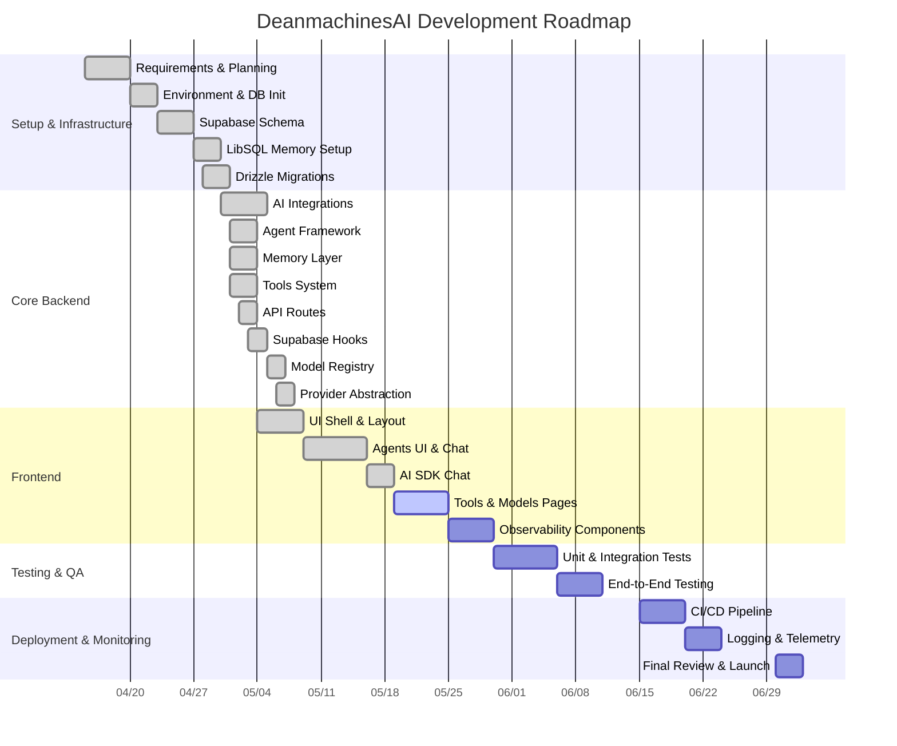

# DeanmachinesAI

[](LICENSE)
[](https://nextjs.org/)
[](https://sdk.vercel.ai/)
[](https://tailwindcss.com/)
[](https://orm.drizzle.team/)
[](https://supabase.com/)
[](https://turso.tech/)
[](https://ai.google.dev/)
[](https://openai.com/)
[](https://anthropic.com/claude)
[](https://www.typescriptlang.org/)
[](https://react.dev/)
[](https://www.framer.com/motion/)
[](https://ui.shadcn.com/)
[](https://langfuse.com/)
[](https://anthropic.com/claude)

---

## Project Roadmap (Gantt Chart)



---

## Chat Context & Prompt Guidelines

When you (AI assistant) join a new chat about this project, use this template to guide your responses:

1. **Background**: This repo implements a full-stack AI SDK framework built on Next.js, Supabase, LibSQL, and AI SDK providers.
2. **Your Role**: Provide code snippets, architectural advice, and troubleshooting steps across frontend (app/, components/, ui/), backend (api/, lib/), and infra (scripts/, types/).
3. **Goals**:
   - Quickly orient on folder responsibilities and data flows (Supabase ↔ API ↔ Agents ↔ Memory ↔ UI).
   - Offer actionable steps for adding features, fixing bugs, or extending modules.
   - Maintain consistency with existing patterns (TypeScript, React, AI SDK conventions).
4. **Constraints**:
   - Avoid proposing large-scale refactors unless requested.
   - Align examples with Supabase-driven configuration, Next.js App Router, and Tailwind/shadcn/ui.
   - Use concise explanations and focused code snippets.
5. **Example Prompt**:
   "Show how to add a new `POST /api/agents` route that uses `agentRegistry` to create an agent in Supabase and returns the new agent JSON."

Use this pattern for all code and documentation suggestions.

---

## 1. Project Overview

DeanmachinesAI is a sophisticated AI platform built with modern technologies:

- **Next.js** (App Router, pages under `app/`)
- **Vercel AI SDK** (provider abstraction, streaming/generation, tools)
- **AI Providers**:
  - **Google AI / Gemini** (primary provider with Gemini 2.5, 2.0, 1.5 models)
  - **OpenAI** (secondary provider with GPT-4.1, GPT-4o, GPT-3.5 models)
  - **Anthropic** (secondary provider with Claude 3.5, Claude 3 models)
  - **Google Vertex AI** (optional provider for enterprise deployments)
- **Model Registry** (centralized configuration for all AI models)
- **Supabase** (configuration, models, agents, settings, performance tracking)
- **LibSQL** (persistent memory, embeddings, vector search)
- **Drizzle ORM** (type-safe database access for both Supabase and LibSQL)
- **shadcn/ui & Tailwind CSS** (UI components and styling)
- **Framer Motion** (advanced animations and transitions)
- **Observability** (performance tracking, cost estimation, tracing)

The platform features a comprehensive model registry system that supports multiple AI providers with a unified interface, cutting-edge UI design with neon green and blue accents, advanced animations, and a fully responsive layout optimized for all devices. The AI SDK Chat implementation provides a rich, interactive chat experience with support for multi-modal content, function calling, and tool execution.

---

## 2. Workspace Structure

```bash
.
├── app/                # Next.js application (layouts, pages, features)
│   ├── (dashboard)/    # Dashboard routes (models, agents, tools, settings)
│   ├── api/            # API routes for agents, tools, models, threads, CRUD
│   └── chat/           # Chat interface routes
├── components/         # Reusable UI components
│   ├── chat/           # Chat-related components
│   ├── layout/         # Layout components (dashboard, sidebar, navbar)
│   ├── observability/  # Monitoring and analytics components
│   └── ui/             # shadcn/ui components
├── db/                 # Database schemas
│   ├── libsql/         # LibSQL schema definitions
│   └── supabase/       # Supabase schema definitions
├── docs/               # Reference docs on AI SDK, prompts, protocols
├── drizzle/            # Drizzle migrations
│   ├── migrations/     # Migration files
│   │   ├── libsql/     # LibSQL migrations
│   │   └── supabase/   # Supabase migrations
├── hooks/              # React hooks
│   ├── use-supabase-crud.ts    # CRUD operations via API routes
│   ├── use-supabase-direct.ts  # Direct Supabase client operations
│   └── use-supabase-fetch.ts   # Data fetching from API routes
├── lib/                # Core backend library
│   ├── agents/         # Agent framework
│   ├── memory/         # Persistence system
│   └── tools/          # Tools system
├── public/             # Static assets
├── styles/             # Global CSS
├── types/              # TypeScript definitions
└── README.md           # Project overview and onboarding
```

---

## 3. Getting Started

### Prerequisites

- Node.js 18+
- Supabase account
- LibSQL/Turso account
- Google AI API key

### Environment Variables

Create a `.env.local` file with the following variables:

```dotenv
# Supabase - For application data
NEXT_PUBLIC_SUPABASE_URL=your_supabase_url
NEXT_PUBLIC_SUPABASE_ANON_KEY=your_supabase_anon_key
DATABASE_URL=your_supabase_postgres_connection_string

# LibSQL - For agent memory and threads
LIBSQL_DATABASE_URL=your_libsql_url
LIBSQL_AUTH_TOKEN=your_libsql_auth_token

# Google AI API - For AI SDK
GOOGLE_API_KEY=your_google_api_key

# Default model ID (optional)
DEFAULT_MODEL_ID=your_default_model_id

# Langfuse - For observability (optional)
LANGFUSE_PUBLIC_KEY=your_langfuse_public_key
LANGFUSE_SECRET_KEY=your_langfuse_secret_key
LANGFUSE_HOST=https://us.cloud.langfuse.com
```

### Authentication Setup

The project uses Supabase Authentication for user management with support for both email/password and GitHub OAuth authentication methods.

1. **Configure Supabase Auth Settings**:
   - In your Supabase dashboard, go to Authentication > Settings
   - Set your Site URL to match your deployment URL (e.g., `http://localhost:3000` for local development)
   - Add any additional redirect URLs under "Redirect URLs"
   - Configure email templates and other auth settings as needed

2. **GitHub OAuth Setup**:
   - Create a GitHub OAuth App in your GitHub account settings
   - Set the callback URL to `http://localhost:3000/api/auth/callback/github` (for development)
   - Configure the GitHub provider in your Supabase dashboard with your Client ID and Secret
   - See detailed instructions in `docs/github-oauth-setup.md`

3. **Authentication Flow**:
   - The project includes callback routes at `/auth/callback` and `/api/auth/callback/github` that handle OAuth flows
   - Admin-specific authentication is handled by `/api/auth/callback/admin-github`
   - The server-side Supabase client in `utils/supabase/server.ts` manages secure authentication operations
   - API routes in `app/api/auth/` handle sign-in and sign-up operations
   - The `GitHubSignInButton` component provides an easy way to integrate GitHub authentication
   - The `AdminGitHubSignInButton` component is available for admin authentication
   - Error handling for authentication failures is provided at `/auth/auth-code-error`
   - A complete sign-in page is available at `/auth/signin`

4. **Admin Authentication**:
   - Admin users can authenticate using GitHub OAuth or email/password
   - Default admin credentials: Email: `owner@deanmachines.com`, Password: `admin!`
   - Admin users have access to additional features and settings
   - Role-based access control is implemented through the `users` table with a `role` field

### Installation

1. Clone the repository:

   ```bash
   git clone https://github.com/yourusername/deanmachinesai.git
   cd deanmachinesai
   ```

2. Install dependencies:

   ```bash
   pnpm install
   ```

3. Run Drizzle migrations for both databases:

   ```bash
   # Generate and run Supabase migrations
   pnpm migrate:generate:supabase init
   pnpm migrate:up:supabase

   # Generate and run LibSQL migrations
   pnpm migrate:generate:libsql init
   pnpm migrate:up:libsql
   ```

4. Run the development server:

   ```bash
   pnpm dev
   ```

5. Open [http://localhost:3000](http://localhost:3000) in your browser.

---

## 4. Current Scope Checklist

- [x] Next.js App Router with dashboards, agents UI, chat, tools pages
- [x] Drizzle ORM integration for both Supabase and LibSQL
- [x] Drizzle migrations for schema management and versioning
- [x] Supabase hooks for data management:
  - [x] `use-supabase-crud.ts` - CRUD operations via API routes
  - [x] `use-supabase-direct.ts` - Direct Supabase client operations
  - [x] `use-supabase-fetch.ts` - Data fetching from API routes
- [x] Generic CRUD API routes with Drizzle support (`/api/crud/[table]`)
- [x] Agent framework in `lib/agents` (BaseAgent, registry, service)
- [x] Memory & persistence in `lib/memory` (threads, messages, embeddings)
- [x] AI provider abstraction:
  - [x] `lib/ai.ts` - Core provider abstraction
  - [x] `lib/ai-integration.ts` - AI SDK integration
  - [x] `lib/google-ai.ts` - Google AI provider
  - [x] `lib/openai-ai.ts` - OpenAI provider
  - [x] `lib/anthropic-ai.ts` - Anthropic provider
  - [x] `lib/vertex-ai.ts` - Google Vertex AI provider
- [x] Model registry system:
  - [x] `lib/model-registry.ts` - Centralized model configurations
  - [x] Supabase schema for models with capabilities
  - [x] Performance and cost tracking tables
- [x] Built-in and custom tools in `lib/tools` and dispatcher
- [x] API routes for agents, chat, tools under `app/api/`
- [x] AI SDK Chat implementation:
  - [x] `components/chat/ai-sdk-chat.tsx` - Frontend component
  - [x] `app/api/chat/ai-sdk/route.ts` - Backend endpoint
  - [x] Thread and message management
  - [x] Tool execution and function calling
- [x] UI components for agents, chat, tools in `components/`
- [x] Observability components with d3, recharts, and plotly visualizations
- [x] Documentation in `docs/` covering prompts and protocols

---

## 5. Future Roadmap

- [ ] Multi-Agent Orchestration and Planning (`lib/agents/multiAgent.ts`)
- [x] Advanced Memory Processors & Vector Store (`lib/memory/vector-store.ts`)
- [x] Embedding batching utility (`lib/memory/store-embedding.ts`)
- [ ] LRU cache for hot threads and tool results
- [x] Expand AI provider support (OpenAI, Anthropic)
- [ ] Agent lifecycle hooks (`onStart`, `onToolCall`, `onFinish`)
- [x] UI for managing models, tools, and agents
- [x] Drizzle migrations for schema management
- [ ] Advanced workflow system for multi-step agent tasks
- [x] Enhanced observability with cost tracking and model evaluation
- [ ] Dynamic persona loading from JSON/YAML config
- [ ] Agent analytics with event logging and metrics
- [ ] Agent versioning and rollback via Supabase
- [ ] Model performance benchmarking and comparison
- [ ] Cost optimization strategies for different providers

---

## 6. Troubleshooting

- **Environment Variables**: Check `.env.local` values match the required variables.
- **Database Connections**:
  - Test Supabase connection with `getSupabaseClient()` from `lib/memory/supabase.ts`
  - Test LibSQL connection with `getLibSQLClient()` from `lib/memory/libsql.ts`
  - Verify Drizzle clients with `getDrizzleClient()` from respective modules
- **API Errors**: Inspect logs and use `api-error-handler.ts` for consistent error handling.
- **Type Issues**: Verify types in `types/` match database schemas in `db/supabase/schema.ts` and `db/libsql/schema.ts`.
- **Migration Issues**:
  - For Supabase: Check `drizzle/migrations/supabase/meta/_journal.json` for migration history
  - For LibSQL: Check `drizzle/migrations/libsql/meta/_journal.json` for migration history
  - Use `pnpm migrate:down:supabase` or `pnpm migrate:down:libsql` to revert problematic migrations

---

## 7. Architecture

### Backend

- **Supabase**: Stores application data (models, tools, agents, settings)
  - PostgreSQL database with Drizzle ORM integration
  - Schema defined in `db/supabase/schema.ts`
  - Migrations managed with Drizzle in `drizzle/migrations/supabase/`

- **LibSQL**: Stores agent memory and conversation history
  - SQLite-compatible database with Drizzle ORM integration
  - Schema defined in `db/libsql/schema.ts`
  - Migrations managed with Drizzle in `drizzle/migrations/libsql/`
  - HNSW vector index for semantic search

- **AI SDK Integration**: Integrates with various AI providers
  - Primary: Google AI (Gemini)
  - Secondary: OpenAI, Anthropic
  - Abstraction layer in `lib/ai.ts` and `lib/ai-integration.ts`
  - Tracing system in `lib/ai-sdk-tracing.ts`
  - Provider-specific implementations with unified interface

- **Memory System**: Manages conversation history and embeddings
  - Thread management in `lib/memory/memory.ts`
  - Message persistence with token counting and embeddings
  - Vector search capabilities for semantic retrieval
  - State management for long-running conversations
  - Supports multiple storage backends (LibSQL, Upstash)

- **API Routes**: Next.js API routes for backend operations
  - Standard routes in `app/api/` for specific endpoints
  - AI SDK-specific routes in `app/api/chat/ai-sdk/`
  - Thread management in `app/api/chat/ai-sdk/threads/`
  - Message management in `app/api/chat/ai-sdk/threads/[id]/messages/`
  - Generic CRUD routes in `app/api/crud/[table]/`
  - Consistent error handling with `lib/api-error-handler.ts`

### Frontend

- **Next.js**: React framework with App Router
  - Dashboard routes in `app/(dashboard)/`
  - Chat interface in `app/chat/ai-sdk/`

- **React Hooks**: Custom hooks for data management
  - `use-supabase-crud.ts`: CRUD operations via API routes
  - `use-supabase-direct.ts`: Direct Supabase client operations
  - `use-supabase-fetch.ts`: Data fetching from API routes

- **UI Components**:
  - **Tailwind CSS**: Utility-first CSS framework
  - **shadcn/ui**: Component library in `components/ui/`
  - **Framer Motion**: Animation library for advanced effects
  - **Layout Components**: Dashboard layout, sidebar, navbar in `components/layout/`
  - **Observability Components**: Visualizations with d3, recharts, and plotly in `components/observability/`
  - **Chat Components**: AI SDK chat interface in `components/chat/ai-sdk-chat.tsx`

### AI SDK Chat Flow

The AI SDK chat implementation follows a comprehensive flow from frontend to backend:

1. **Frontend Component** (`components/chat/ai-sdk-chat.tsx`):
   - Uses `useChat` hook from `@ai-sdk/react`
   - Manages UI state, message history, and user interactions
   - Handles file attachments and image uploads
   - Supports tool execution and function calling
   - Provides real-time streaming of responses
   - Offers model and temperature configuration

2. **API Endpoint** (`app/api/chat/ai-sdk/route.ts`):
   - Receives requests from the frontend
   - Validates input parameters
   - Processes messages and attachments
   - Configures AI model based on settings
   - Creates traces for observability
   - Streams responses back to the client

3. **Thread Management** (`app/api/chat/ai-sdk/threads/`):
   - Creates and manages chat threads
   - Lists available threads with pagination
   - Updates thread metadata
   - Deletes threads with cascade

4. **Message Management** (`app/api/chat/ai-sdk/threads/[id]/messages/`):
   - Adds messages to threads
   - Retrieves message history
   - Counts tokens for context management
   - Generates embeddings for semantic search

5. **AI SDK Integration** (`lib/ai-sdk-integration.ts`):
   - Provides unified interface for multiple AI providers
   - Handles streaming and generation
   - Configures tools and function calling
   - Manages tracing and observability

6. **Memory System** (`lib/memory/memory.ts`):
   - Persists threads and messages
   - Manages token counting and embeddings
   - Provides semantic search capabilities
   - Handles state management for conversations

---

```mermaid
graph TD
graph TD

    50263["End User<br>External Actor"]
    subgraph 50254["External Systems"]
        50255["External Tool APIs"]
        50291["OpenAI API Service<br>External AI Provider"]
        50292["Anthropic API Service<br>External AI Provider"]
        50293["Google AI Services<br>Vertex AI, Generative AI"]
        50294["Langfuse Platform<br>External Observability"]
        50295["OpenTelemetry Collector<br>External Observability"]
        50296["Supabase BaaS<br>Auth, Realtime, Storage"]
        50297["Upstash Platform<br>QStash, Redis"]
    end
    subgraph 50256["AI SDK Platform"]
        50257["Shared Kernel"]
        50258["Data Persistence Layer"]
        50259["AI SDK Core Library"]
        50261["Backend API Service"]
        50262["Frontend Application"]
        %% Edges at this level (grouped by source)
        50259["AI SDK Core Library"] -->|retrieves model config from| 50258["Data Persistence Layer"]
        50261["Backend API Service"] -->|accesses| 50258["Data Persistence Layer"]
    end
    %% Edges at this level (grouped by source)
    50259["AI SDK Core Library"] -->|connects to| 50255["External Tool APIs"]
    50259["AI SDK Core Library"] -->|connects to| 50291["OpenAI API Service<br>External AI Provider"]
    50259["AI SDK Core Library"] -->|connects to| 50292["Anthropic API Service<br>External AI Provider"]
    50259["AI SDK Core Library"] -->|connects to| 50293["Google AI Services<br>Vertex AI, Generative AI"]
    50259["AI SDK Core Library"] -->|sends traces/logs to| 50294["Langfuse Platform<br>External Observability"]
    50259["AI SDK Core Library"] -->|sends traces/metrics to| 50295["OpenTelemetry Collector<br>External Observability"]
    50259["AI SDK Core Library"] -->|uses for queuing| 50297["Upstash Platform<br>QStash, Redis"]
    50261["Backend API Service"] -->|handles auth via| 50296["Supabase BaaS<br>Auth, Realtime, Storage"]
    50263["End User<br>External Actor"] -->|interacts with| 50262["Frontend Application"]
    50262["Frontend Application"] -->|fetches data via| 50296["Supabase BaaS<br>Auth, Realtime, Storage"]
    50262["Frontend Application"] -->|sends messages to| 50261["Backend API Service"]
    50262["Frontend Application"] -->|sends messages to| 50259["AI SDK Core Library"]
    50261["Backend API Service"] -->|sends messages to| 50259["AI SDK Core Library"]
    50261["Backend API Service"] -->|sends messages to| 50258["Data Persistence Layer"]
    50258["Data Persistence Layer"] -->|persists| 50259["AI SDK Core Library"]
    50258["Data Persistence Layer"] -->|persists| 50261["Backend API Service"]
```

---

## 8. Model Registry and Providers

DeanmachinesAI implements a comprehensive model registry system that supports multiple AI providers with a unified interface.

### Model Registry

The model registry (`lib/model-registry.ts`) provides a centralized repository of AI model configurations:

- **Google AI Models**: Gemini 2.5, Gemini 2.0, Gemini 1.5, PaLM 2, and Imagen models
- **OpenAI Models**: GPT-4.1, GPT-4o, GPT-4 Turbo, GPT-3.5 Turbo, and DALL-E models
- **Anthropic Models**: Claude 3.5 Opus, Claude 3.5 Sonnet, Claude 3 Opus, Claude 3 Sonnet, and Claude 3 Haiku

Each model configuration includes:

```typescript
interface ModelSettings {
  id: string;                        // Unique identifier
  name: string;                      // Display name
  provider: ModelProvider;           // "google", "openai", "anthropic", etc.
  model_id: string;                  // Provider-specific model ID
  max_tokens: number;                // Maximum output tokens
  input_cost_per_token: number;      // Cost per input token
  output_cost_per_token: number;     // Cost per output token
  supports_vision: boolean;          // Supports image inputs
  supports_functions: boolean;       // Supports function calling
  supports_streaming: boolean;       // Supports streaming responses
  default_temperature: number;       // Default temperature setting
  default_top_p: number;             // Default top-p setting
  default_frequency_penalty: number; // Default frequency penalty
  default_presence_penalty: number;  // Default presence penalty
  context_window: number;            // Maximum context window size
  status: "active" | "inactive";     // Model status
  base_url?: string | null;          // Optional custom base URL
  api_key?: string;                  // API key (stored securely)
  description?: string;              // Model description
  category?: ModelCategory;          // "text", "vision", "multimodal", etc.
  capabilities?: ModelCapabilities;  // Detailed capability flags
  metadata?: Record<string, any>;    // Additional metadata
}
```

### Provider Integration

The provider integration system (`lib/ai.ts`, `lib/ai-integration.ts`) provides a unified interface for working with different AI providers:

- **Google AI**: Primary provider with Gemini models
  - Implementation: `lib/google-ai.ts`
  - Supports: Text generation, vision, function calling, streaming
  - Models: Gemini 2.5 Pro, Gemini 2.0 Pro, Gemini 2.0 Flash, etc.

- **OpenAI**: Secondary provider
  - Implementation: `lib/openai-ai.ts`
  - Supports: Text generation, vision, function calling, streaming
  - Models: GPT-4.1, GPT-4o, GPT-4 Turbo, GPT-3.5 Turbo, etc.

- **Anthropic**: Secondary provider
  - Implementation: `lib/anthropic-ai.ts`
  - Supports: Text generation, vision, function calling, streaming
  - Models: Claude 3.5 Opus, Claude 3.5 Sonnet, Claude 3 Opus, etc.

- **Google Vertex AI**: Optional provider
  - Implementation: `lib/vertex-ai.ts`
  - Supports: Text generation, vision, function calling
  - Models: Gemini Pro, PaLM 2, etc.

### Database Schema

The model configurations are stored in Supabase using the following schema:

```typescript
// From db/supabase/schema.ts
export const models = pgTable('models', {
  id: varchar('id', { length: 36 }).primaryKey(),
  name: text('name').notNull(),
  provider: text('provider').notNull(),
  model_id: text('model_id').notNull(),
  max_tokens: integer('max_tokens').notNull().default(4096),
  input_cost_per_token: numeric('input_cost_per_token').notNull().default('0.0'),
  output_cost_per_token: numeric('output_cost_per_token').notNull().default('0.0'),
  supports_vision: boolean('supports_vision').notNull().default(false),
  supports_functions: boolean('supports_functions').notNull().default(false),
  supports_streaming: boolean('supports_streaming').notNull().default(true),
  default_temperature: numeric('default_temperature').notNull().default('0.7'),
  default_top_p: numeric('default_top_p').notNull().default('1.0'),
  default_frequency_penalty: numeric('default_frequency_penalty').notNull().default('0.0'),
  default_presence_penalty: numeric('default_presence_penalty').notNull().default('0.0'),
  context_window: integer('context_window').notNull().default(8192),
  description: text('description'),
  category: text('category').notNull().default('text'),
  capabilities: jsonb('capabilities').notNull(),
  metadata: jsonb('metadata'),
  base_url: text('base_url'),
  api_key: text('api_key').notNull(),
  status: text('status').notNull(),
  created_at: timestamp('created_at', { withTimezone: true }).defaultNow(),
  updated_at: timestamp('updated_at', { withTimezone: true }).defaultNow(),
})
```

### Performance Tracking

The system includes tables for tracking model performance and costs:

```typescript
// Model performance tracking
export const model_performance = pgTable('model_performance', {
  id: varchar('id', { length: 36 }).primaryKey(),
  modelId: varchar('modelId', { length: 36 }).notNull(),
  provider: text('provider').notNull(),
  displayName: text('displayName').notNull(),
  timestamp: timestamp('timestamp', { withTimezone: true }).notNull(),
  latency_ms: numeric('latency_ms').notNull(),
  tokens_per_second: numeric('tokens_per_second').notNull(),
  success_rate: numeric('success_rate').notNull(),
  request_count: integer('request_count').notNull(),
  total_tokens: integer('total_tokens').notNull(),
  error_count: integer('error_count').notNull(),
  metadata: jsonb('metadata').default({}),
})

// Model cost tracking
export const model_costs = pgTable('model_costs', {
  id: varchar('id', { length: 36 }).primaryKey(),
  modelId: varchar('modelId', { length: 36 }).notNull(),
  provider: text('provider').notNull(),
  displayName: text('displayName').notNull(),
  costPerInputToken: numeric('costPerInputToken').notNull(),
  costPerOutputToken: numeric('costPerOutputToken').notNull(),
  date: timestamp('date', { withTimezone: true }).notNull(),
  cost: numeric('cost').notNull(),
  inputTokens: integer('inputTokens').notNull(),
  outputTokens: integer('outputTokens').notNull(),
  requests: integer('requests').notNull(),
  metadata: jsonb('metadata').default({}),
})
```

### Provider Usage Example

```typescript
// Get a model configuration
const modelConfig = await getModelConfig('gemini-2.0-pro');

// Stream text with a specific provider
const result = await streamGoogleAI({
  modelId: 'gemini-2.0-pro',
  messages: [{ role: 'user', content: 'Hello, world!' }],
  temperature: 0.7,
  maxTokens: 1024,
});

// Generate text with provider abstraction
const response = await generateAIResponse({
  provider: 'google',
  modelName: 'gemini-2.0-pro',
  messages: [{ role: 'user', content: 'Hello, world!' }],
  temperature: 0.7,
  maxTokens: 1024,
});
```

## 9. AI SDK Chat Implementation

The AI SDK Chat component is a sophisticated implementation that leverages the Vercel AI SDK to provide a rich, interactive chat experience with advanced features:

### Frontend Component

The `AiSdkChat` component (`components/chat/ai-sdk-chat.tsx`) offers:

- **Thread Management**: Create, switch between, and manage conversation threads
- **Message History**: Display and persist message history with proper formatting
- **File Attachments**: Upload and display images and other file types
- **Voice Input**: Record and transcribe voice messages
- **Tool Execution**: Execute various tools through function calling
- **Real-time Streaming**: Stream responses in real-time with typing indicators
- **Model Configuration**: Configure model, temperature, and other parameters
- **UI Customization**: Customize the appearance and behavior of the chat interface

### Backend Implementation

The AI SDK Chat backend (`app/api/chat/ai-sdk/route.ts` and related files) provides:

- **Provider Abstraction**: Support for Google AI, OpenAI, and Anthropic
- **Thread Persistence**: Store and retrieve conversation threads
- **Message Storage**: Save messages with token counting and embeddings
- **Tool Integration**: Execute tools and return results to the frontend
- **Tracing & Observability**: Track performance and usage metrics
- **Error Handling**: Graceful error handling with detailed messages

### Data Flow

1. User sends a message via the `AiSdkChat` component
2. Message is sent to `/api/chat/ai-sdk` endpoint
3. Backend processes the message and selects the appropriate AI provider
4. AI generates a response, potentially with tool calls
5. Response is streamed back to the frontend
6. Frontend displays the response and executes any tool calls
7. Messages are persisted to the memory system

### Key Features

- **Multi-modal Support**: Handle text, images, and other content types
- **Function Calling**: Execute tools and display results inline
- **Streaming Protocol**: Support for both text and data streaming protocols
- **Thread Management**: Create, list, and switch between conversation threads
- **Token Management**: Count tokens to stay within model context limits
- **Embedding Generation**: Generate embeddings for semantic search
- **Tool Configuration**: Enable/disable tools based on user preferences
- **System Prompts**: Configure system prompts for different use cases

### Usage Example

```tsx
// In a Next.js page component
import { AiSdkChat } from '@/components/chat/ai-sdk-chat';

export default function ChatPage() {
  return (
    <div className="h-screen">
      <AiSdkChat
        apiEndpoint="/api/chat/ai-sdk"
        modelId="gemini-1.5-pro"
        temperature={0.7}
        maxTokens={8192}
        tools={['search', 'calculator', 'weather']}
        systemPrompt="You are a helpful assistant."
      />
    </div>
  );
}
```

## 9. Customization

### Adding New Models

Add new models through the models page in the dashboard or using the API:

1. **Using the UI**:
   - Navigate to `/models` in the dashboard
   - Click "Add Model" and fill in the required fields
   - Save the model to make it available for agents

2. **Using the API**:

   ```typescript
   // POST /api/models
   const response = await fetch('/api/models', {
     method: 'POST',
     headers: { 'Content-Type': 'application/json' },
     body: JSON.stringify({
       name: 'My Custom Model',
       provider: 'google',
       modelId: 'gemini-1.5-pro',
       apiKey: 'your-api-key',
       status: 'active'
     })
   });
   ```

3. **Using Drizzle directly**:

   ```typescript
   import { models } from '@/db/supabase/schema';
   import { getDrizzleClient } from '@/lib/memory/drizzle';

   const db = getDrizzleClient();
   const result = await db.insert(models).values({
     id: crypto.randomUUID(),
     name: 'My Custom Model',
     provider: 'google',
     model_id: 'gemini-1.5-pro',
     api_key: 'your-api-key',
     status: 'active',
   }).returning();
   ```

### Creating Custom Tools

1. **Using the UI**:
   - Navigate to `/tools` in the dashboard
   - Click "Add Tool" and fill in the required fields
   - Define the parameters schema in JSON Schema format
   - Save the tool to make it available for agents

2. **Using the API**:

   ```typescript
   // POST /api/tools
   const response = await fetch('/api/tools', {
     method: 'POST',
     headers: { 'Content-Type': 'application/json' },
     body: JSON.stringify({
       name: 'My Custom Tool',
       description: 'A custom tool for specific tasks',
       parametersSchema: JSON.stringify({
         type: 'object',
         properties: {
           param1: { type: 'string', description: 'First parameter' },
           param2: { type: 'number', description: 'Second parameter' }
         },
         required: ['param1']
       }),
       category: 'utility'
     })
   });
   ```

3. **Implement the tool executor** in `lib/tools/custom-tools.ts`

### Creating Custom Agents

1. **Using the UI**:
   - Navigate to `/agents` in the dashboard
   - Click "Add Agent" and fill in the required fields
   - Select a model and tools for the agent
   - Define the system prompt
   - Save the agent to make it available for use

2. **Using the API**:

   ```typescript
   // POST /api/agents
   const response = await fetch('/api/agents', {
     method: 'POST',
     headers: { 'Content-Type': 'application/json' },
     body: JSON.stringify({
       name: 'My Custom Agent',
       description: 'A custom agent for specific tasks',
       modelId: 'model-id',
       toolIds: ['tool-id-1', 'tool-id-2'],
       systemPrompt: 'You are a helpful assistant...'
     })
   });
   ```

---

## 11. Deployment

### Vercel Deployment

Deploy to Vercel with the following configuration:

1. **Environment Variables**:
   - Add all environment variables from your `.env.local` file
   - Ensure database connection strings are properly configured

2. **Build Settings**:
   - Build Command: `pnpm build`
   - Output Directory: `.next`
   - Install Command: `pnpm install`

3. **Database Setup**:
   - Run migrations before deployment:

     ```bash
     pnpm migrate:up:supabase
     pnpm migrate:up:libsql
     ```

4. **One-Click Deploy**:

   [](https://vercel.com/new/clone?repository-url=https://github.com/yourusername/deanmachinesai)

### Docker Deployment

For containerized deployment:

1. **Build the Docker image**:

   ```bash
   docker build -t deanmachinesai .
   ```

2. **Run the container**:

   ```bash
   docker run -p 3000:3000 --env-file .env.local deanmachinesai
   ```

3. **Docker Compose** (for development with databases):

   ```yaml
   # docker-compose.yml
   version: '3'
   services:
     app:
       build: .
       ports:
         - "3000:3000"
       env_file:
         - .env.local
       depends_on:
         - supabase
     supabase:
       image: supabase/supabase-local
       ports:
         - "54322:5432"
   ```

---

## 12. License

This project is licensed under the MIT License - see the LICENSE file for details.

---

## 13. Documentation

For detailed module documentation, refer to:

- `lib/README.md` - Core library overview
- `lib/agents/README.md` - Agent framework documentation
- `lib/tools/README.md` - Tools system documentation
- `lib/memory/README.md` - Memory system documentation
- `docs/` - AI SDK best practices and protocols

## 14. Contributing

Contributions are welcome! Please feel free to submit a Pull Request.

1. Fork the repository
2. Create your feature branch (`git checkout -b feature/amazing-feature`)
3. Commit your changes (`git commit -m 'Add some amazing feature'`)
4. Push to the branch (`git push origin feature/amazing-feature`)
5. Open a Pull Request

---

Built with ❤️ using Next.js, Vercel AI SDK, Supabase, LibSQL, and Drizzle ORM.
