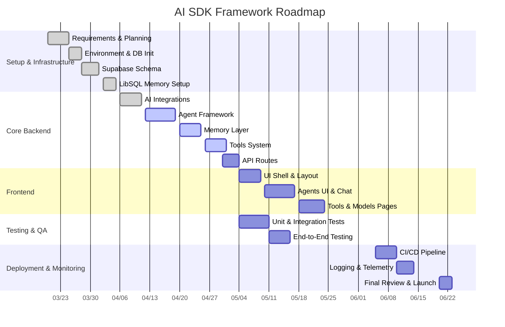

```mermaid
graph TD
    14520["User<br>External Actor"]
    subgraph 14514["AI SDK System"]
        14544["Initialization Scripts<br>TypeScript"]
        subgraph 14515["Database Abstraction"]
            14542["Supabase Client Wrapper<br>TypeScript"]
            14543["LibSQL Client Wrapper<br>TypeScript"]
        end
        subgraph 14516["Core Libraries"]
            14534["Agent Service<br>TypeScript"]
            14535["AI Integration<br>TypeScript"]
            14536["Agentic Toolkit Integration<br>TypeScript"]
            14537["Tool Definitions &amp; Execution<br>TypeScript"]
            14538["Memory Management<br>TypeScript"]
            14539["Langfuse Integration<br>TypeScript"]
            14540["Shared Types<br>TypeScript"]
            14541["Utilities<br>TypeScript"]
        end
        subgraph 14517["Backend API"]
            14533["API Routes<br>Next.js API Routes"]
        end
        subgraph 14518["Frontend Application"]
            14528["Web Application<br>Next.js"]
            14529["Dashboard Pages<br>Next.js/React"]
            14530["UI Library<br>React/Shadcn UI"]
            14531["Application Components<br>React"]
            14532["Custom Hooks<br>React"]
            %% Edges at this level (grouped by source)
            14528["Web Application<br>Next.js"] -->|Renders| 14529["Dashboard Pages<br>Next.js/React"]
            14529["Dashboard Pages<br>Next.js/React"] -->|Uses| 14530["UI Library<br>React/Shadcn UI"]
            14529["Dashboard Pages<br>Next.js/React"] -->|Uses| 14531["Application Components<br>React"]
        end
        %% Edges at this level (grouped by source)
        14529["Dashboard Pages<br>Next.js/React"] -->|Makes API calls to| 14533["API Routes<br>Next.js API Routes"]
    end
    subgraph 14519["External Systems"]
        14521["Supabase<br>BaaS/Database"]
        14522["LibSQL<br>Database"]
        14523["Google AI / Vertex AI<br>External AI Service"]
        14524["Agentic Toolkit<br>External Service/Library"]
        14525["Langfuse<br>Observability Service"]
        14526["Web Tools Provider<br>External Service (Search/Scrape)"]
        14527["Code Execution Environment<br>External Service"]
    end
    %% Edges at this level (grouped by source)
    14520["User<br>External Actor"] -->|Uses| 14528["Web Application<br>Next.js"]
    14542["Supabase Client Wrapper<br>TypeScript"] -->|Connects to| 14521["Supabase<br>BaaS/Database"]
    14543["LibSQL Client Wrapper<br>TypeScript"] -->|Connects to| 14522["LibSQL<br>Database"]
    14535["AI Integration<br>TypeScript"] -->|Calls| 14523["Google AI / Vertex AI<br>External AI Service"]
    14536["Agentic Toolkit Integration<br>TypeScript"] -->|Integrates with| 14524["Agentic Toolkit<br>External Service/Library"]
    14539["Langfuse Integration<br>TypeScript"] -->|Sends data to| 14525["Langfuse<br>Observability Service"]
    14537["Tool Definitions &amp; Execution<br>TypeScript"] -->|Executes Web Tools via| 14526["Web Tools Provider<br>External Service (Search/Scrape)"]
    14537["Tool Definitions &amp; Execution<br>TypeScript"] -->|Executes Code via| 14527["Code Execution Environment<br>External Service"]
```

# AI SDK Framework

[](https://github.com/yourusername/ai-sdk-framework/actions)
[](LICENSE)
[](https://www.npmjs.com/package/ai-sdk-framework)
[](#)

---

## Project Roadmap (Gantt Chart)



---

## Chat Context & Prompt Guidelines

When you (AI assistant) join a new chat about this project, use this template to guide your responses:

1. **Background**: This repo implements a full-stack AI SDK framework built on Next.js, Supabase, LibSQL, and AI SDK providers.
2. **Your Role**: Provide code snippets, architectural advice, and troubleshooting steps across frontend (app/, components/, ui/), backend (api/, lib/), and infra (scripts/, types/).
3. **Goals**:
   - Quickly orient on folder responsibilities and data flows (Supabase ↔ API ↔ Agents ↔ Memory ↔ UI).
   - Offer actionable steps for adding features, fixing bugs, or extending modules.
   - Maintain consistency with existing patterns (TypeScript, React, AI SDK conventions).
4. **Constraints**:
   - Avoid proposing large-scale refactors unless requested.
   - Align examples with Supabase-driven configuration, Next.js App Router, and Tailwind/shadcn/ui.
   - Use concise explanations and focused code snippets.
5. **Example Prompt**:
   "Show how to add a new `POST /api/agents` route that uses `agentRegistry` to create an agent in Supabase and returns the new agent JSON."

Use this pattern for all code and documentation suggestions.

---

## 1. Project Overview

A customizable AI framework integrating:
- **Next.js** (App Router, pages under `app/`)
- **Supabase** (models, tools, agents, settings)
- **LibSQL** (persistent memory and embeddings)
- **AI SDK** (provider abstraction, streaming/generation, tools)
- **shadcn/ui & Tailwind CSS** (UI components)
- **Agent Framework** (BaseAgent, registry, multi-agent planning)

The main objective is to build a full AI SDK ecosystem enabling rapid development of agent-driven applications.

---

## 2. Workspace Structure

```
.
├── app/               # Next.js application (layouts, pages, features)
├── api/               # Serverless routes for agents, tools, models, threads
├── components/        # Reusable UI components, theme provider
├── docs/              # Reference docs on AI SDK, prompts, protocols
├── hooks/             # React hooks (Supabase CRUD, toast, mobile detection)
├── lib/               # Core backend library (AI, agents, memory, tools)
├── public/            # Static assets
├── scripts/           # DB initialization and migration scripts
├── styles/            # Global CSS
├── types/             # TypeScript definitions for Supabase, agents, tools
└── README.md          # Project overview and onboarding
```

---

## 3. Getting Started

### Prerequisites

- Node.js 18+
- Supabase account
- LibSQL/Turso account
- Google AI API key

### Environment Variables

Create a `.env.local` file with the following variables:

```dotenv
NEXT_PUBLIC_SUPABASE_URL=your_supabase_url
NEXT_PUBLIC_SUPABASE_ANON_KEY=your_supabase_anon_key
LIBSQL_DATABASE_URL=your_libsql_url
LIBSQL_AUTH_TOKEN=your_libsql_token
GOOGLE_API_KEY=your_google_ai_api_key
DEFAULT_MODEL_ID=google-gemini-pro
```

### Installation

1. Clone the repository:
   ```bash
   git clone https://github.com/yourusername/ai-sdk-framework.git
   cd ai-sdk-framework
   ```

2. Install dependencies:
   ```bash
   pnpm install
   ```

3. Initialize the database:
   ```bash
   pnpm tsx scripts/init-database.ts
   pnpm tsx scripts/init-supabase.ts
   ```

4. Run the development server:
   ```bash
   pnpm dev
   ```

5. Open [http://localhost:3000](http://localhost:3000) in your browser.

---

## 4. Current Scope Checklist

- [x] Next.js App Router with dashboards, agents UI, chat, tools pages
- [x] Supabase CRUD for models, tools, agents via `use-supabase-crud` hooks
- [x] Agent framework in `lib/agents` (BaseAgent, registry, service)
- [x] Memory & persistence in `lib/memory` (threads, messages, embeddings)
- [x] AI provider abstraction (`lib/ai.ts`, `google-ai.ts`)
- [x] Built-in and custom tools in `lib/tools` and dispatcher
- [x] API routes for agents, chat, tools under `api/`
- [x] UI components for agents, chat, tools in `components/agents`, `ui/`
- [x] Documentation in `docs/` covering prompts and protocols

---

## 5. Future Roadmap

- [ ] Multi-Agent Orchestration and Planning (lib/agents/multiAgent.ts)
- [ ] Advanced Memory Processors & Vector Store (lib/memory/vector-store.ts)
- [ ] Embedding batching utility (lib/memory/store-embedding.ts)
- [ ] LRU cache for hot threads and tool results
- [ ] Expand AI provider support (OpenAI, Anthropic)
- [ ] Agent lifecycle hooks and versioning
- [ ] UI for managing models, tools, and agents
- [ ] CI/CD and migration tooling with Liquibase

---

## 6. Troubleshooting

- **Environment Variables**: Check `.env.local` values.
- **Database Connections**: Test Supabase and LibSQL clients.
- **API Errors**: Inspect logs and use `api-error-handler.ts`.
- **Type Issues**: Verify types in `types/` match database schemas.

---

## Architecture

### Backend

- **Supabase**: Stores application data (models, tools, agents, settings)
- **LibSQL**: Stores agent memory and conversation history
- **AI SDK**: Integrates with various AI providers

### Frontend

- **Next.js**: React framework with App Router
- **Tailwind CSS**: Utility-first CSS framework
- **shadcn/ui**: Component library
- **Framer Motion**: Animation library

---



---

## Customization

### Adding New Models

Add new models through the settings page or directly in the Supabase database.

### Creating Custom Tools

1. Define the tool in the Supabase database
2. Implement the tool executor in `lib/tool-execution.ts`
3. Assign the tool to agents as needed

### Creating Custom Agents

Create new agents through the agents page or directly in the Supabase database.

---

## Deployment

Deploy to Vercel:

[](https://vercel.com/new/clone?repository-url=https://github.com/yourusername/ai-sdk-framework)

---

## License

This project is licensed under the MIT License - see the LICENSE file for details.

---

For detailed module docs, refer to `lib/README.md`, `lib/agents/README.md`, `lib/tools/README.md`, and `lib/memory/README.md`. For AI SDK best practices, see `docs/`.
